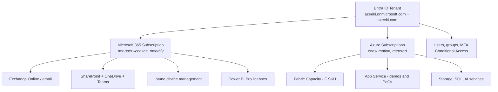

# Azeeki — Greenfield Microsoft Cloud Buildout Plan

**Created:** September 2, 2026
**Scope:** Entra ID tenant, Microsoft 365, Azure subscriptions, Fabric and Power BI,
App Service for demos and PoCs.
**Out of scope:** the public website. `azeeki.com` stays on WordPress at GoDaddy.

**Companion:** `Licensing-Action-Plan.md` holds the licensing decisions, the reading list
with documentation links, and the purchase sequence. This file is the build.

> **Handling note.** This workspace is a Git repository. Do not record tenant IDs,
> subscription IDs, passwords, recovery codes, or secrets in this file.

---

## 1. The Core Concept — Are These Separate Entities?

No. **One tenant, one identity system, two billing relationships.**

Microsoft Entra ID is the identity backbone. Microsoft 365 and Azure are two different
things you *buy*, and both attach to the same Entra tenant. One login, one directory,
one set of security policies.



The single most important consequence: **create the tenant once, correctly, and never
create a second one for the business.** Everything else attaches to it.

Common failure mode for small businesses: signing up for email one place, activating
Azure credits somewhere else with a personal Microsoft account, and ending up with two
or three orphan tenants that cannot be merged. Tenants cannot be merged. Get this right
on day one.

---

## 2. Read This Before You Click Anything

### 2.1 Do not buy Microsoft 365 through GoDaddy

GoDaddy resells Microsoft 365. If you buy it there, GoDaddy provisions and partially
controls the tenant, admin access is restricted, and detaching later is genuinely
painful.

**Buy Microsoft 365 directly from Microsoft.** GoDaddy stays what it is: your domain
registrar and WordPress host.

- [ ] Check whether `azeeki.com` already has GoDaddy email or a GoDaddy-provisioned M365
      subscription attached. If it does, resolve that before creating the tenant.

### 2.2 Visual Studio Azure credit is a sandbox, not a business platform

Confirmed limitations on the monthly Visual Studio Azure credit:

| Limitation | Consequence for Azeeki |
|---|---|
| Dev/test use only, explicitly not production | Anything client-facing must not run here |
| No financially backed SLA | Never point a client at it |
| Microsoft may suspend instances running continuously **more than 120 hours** | Kills always-on demo apps and always-on Fabric capacity |
| Credit does not cover Application Insights, Azure DevOps, support plans, Entra ID P2, third-party Marketplace products | Budget for these separately |
| Credits are individual and cannot be pooled | Does not scale if you ever add a person |
| If the VS subscription lapses, the Azure subscription is disabled | Business continuity risk |

**Use it for:** personal learning, throwaway experiments, testing an ARM template.

**Do not use it for:** client demos, anything holding client data, Fabric capacity backing
a real deliverable, or anything that needs to still exist next quarter.

Plan for **two Azure subscriptions** from the start. See section 6.

### 2.3 The Visual Studio M365 E5 developer benefit is a separate sandbox tenant

Some Visual Studio subscription levels include a Microsoft 365 E5 developer subscription.
That is a **separate tenant** with sample data, and it is excellent for demos.

Keep it separate. Do not attempt to make it the Azeeki business tenant — it has a
different lifecycle and different terms. Treat it as a demo rig.

---

## 3. Identity Design

### 3.1 Account plan

| Account | Domain | Purpose | License | Admin roles |
|---|---|---|---|---|
| `eric@azeeki.com` | azeeki.com | Daily driver. Email, Teams, laptop sign-in, client-facing identity. | M365 Business Premium + Power BI Pro | None by default |
| `adm.eric@azeeki.com` | azeeki.com | Administration of tenant and Azure. | Unlicensed or minimal | Global Administrator |
| `bga1@azeeki.onmicrosoft.com` | onmicrosoft.com | Emergency access #1 | Unlicensed | Global Administrator, permanent |
| `bga2@azeeki.onmicrosoft.com` | onmicrosoft.com | Emergency access #2 | Unlicensed | Global Administrator, permanent |

**Why the separate admin account.** Your daily driver handles email and browses the web,
which is where compromise happens. Separating it means a phished session does not hand
over the tenant. You are a consultant who will advise clients on exactly this — run it
yourself.

If the friction proves unworkable for a one-person shop, the acceptable fallback is
`eric@` holding Global Administrator with a **passkey enforced**, plus both break-glass
accounts. What is not acceptable is a permanently privileged daily driver with only SMS
or app-based MFA.

### 3.2 Break-glass accounts — the details that matter

Microsoft's guidance, applied:

- [ ] Create **two**, so a problem with one does not lock you out
- [ ] Use the **`.onmicrosoft.com` domain**, never `azeeki.com`. If DNS or domain
      federation breaks, these still work.
- [ ] Cloud-only. No sync, no association with any individual person.
- [ ] **Global Administrator, permanently assigned.** Not eligible-only.
- [ ] Unlicensed. They do not need mailboxes.
- [ ] Create a security group named `EmergencyAccess` and put both in it
- [ ] **Exclude that group from every Conditional Access policy that blocks or restricts
      sign-in.** Report-only policies do not need the exclusion.
- [ ] Register a **FIDO2 passkey** on each. Mandatory MFA now applies to Azure, Entra,
      and Intune portal sign-ins regardless of Conditional Access, so a password-only
      break-glass account will fail exactly when you need it.
- [ ] Use different authentication mechanisms across the two accounts where possible
- [ ] Long random passwords, split into two halves, stored offline in separate physical
      locations. Not in this repo. Not in the password manager you sign into with `eric@`.
- [ ] Configure a sign-in alert on both accounts. Any use is either you in an emergency
      or an incident.
- [ ] **Test both quarterly.** Untested break-glass is not break-glass. Put it on the
      calendar now.

### 3.3 Groups

Create these on day one even though you are one person. Retrofitting group-based
assignment later is tedious.

| Group | Type | Purpose |
|---|---|---|
| `EmergencyAccess` | Security | CA exclusions |
| `AllStaff` | Security, dynamic | Baseline CA policy target |
| `PowerBI-Creators` | Security | Fabric and Power BI workspace access |
| `Azure-Contributors` | Security | Azure RBAC assignment |

---

## 4. Licensing Plan

### 4.1 Recommended

| Product | Qty | Approx. cost | Why |
|---|---|---|---|
| Microsoft 365 **Business Premium** | 1 | ~$22/user/mo | Office apps, email, Teams, SharePoint, **plus Intune and Entra ID P1** |
| Power BI Pro | 1 | ~$14/user/mo | Not included in any Business SKU |
| Azure — VS credit subscription | 1 | $0 (benefit) | Sandbox |
| Azure — Pay-As-You-Go | 1 | Consumption | Client-facing demos, Fabric |
| Microsoft Fabric F2 capacity | 1 | ~$0.36/hr, **pausable** | Fabric workloads |

Verify all pricing at purchase. Figures are directional.

### 4.2 Business Premium vs. Business Standard

Take **Premium**. The delta is roughly $10/user/month and it buys:

- **Entra ID P1** — Conditional Access. Without it you get Security Defaults only, which
  is all-or-nothing and cannot exclude break-glass accounts properly or require compliant
  devices.
- **Intune** — enroll and manage the new laptop, enforce disk encryption, remote wipe
- **Defender for Business** — endpoint protection

For a consultancy that will be asked about its own security posture during client
onboarding and vendor risk review, Standard is a false economy.

### 4.3 Power BI licensing

Not included in Business Standard or Business Premium. You need Power BI Pro as an
add-on to publish and share content.

Note the distinction:

| Thing | Where it is bought | What it does |
|---|---|---|
| Power BI Pro license | Microsoft 365 side, per user | Lets *you* author and share |
| Fabric F SKU capacity | Azure side, per hour | Runs the *workloads* |

---

## 5. Day 1 Build Sequence

Order matters. Roughly two to three hours of actual work, plus DNS propagation.

### Step 1 — Create the tenant (20 min)

- [ ] Go to microsoft.com, buy **Microsoft 365 Business Premium**, 1 seat, directly from
      Microsoft
- [ ] Set tenant country to **United States** — this is permanent and determines data
      residency
- [ ] Choose the initial domain carefully: `azeeki.onmicrosoft.com` if available. It
      cannot be removed later.
- [ ] Create the initial admin as `adm.eric@azeeki.onmicrosoft.com`

### Step 2 — Break-glass accounts (20 min)

Do this **before** any Conditional Access policy exists. Section 3.2 is the checklist.

- [ ] Create `bga1` and `bga2`
- [ ] Assign Global Administrator to both
- [ ] Register passkeys
- [ ] Create the `EmergencyAccess` group
- [ ] Store credentials offline

### Step 3 — Add and verify azeeki.com (30 min + propagation)

- [ ] Add `azeeki.com` as a custom domain in the Microsoft 365 admin center
- [ ] Add the TXT verification record at GoDaddy
- [ ] Verify

Then add the mail records. See section 9 for the full DNS table.

**Do not touch the A record or the `www` CNAME.** Those point at WordPress and must stay.

### Step 4 — Create users (15 min)

- [ ] Create `eric@azeeki.com`, assign Business Premium
- [ ] Add Power BI Pro
- [ ] Move admin roles to `adm.eric@azeeki.com`
- [ ] Confirm `eric@` holds no standing admin roles

### Step 5 — Security baseline (30 min)

- [ ] Register a passkey for `eric@` and `adm.eric@`
- [ ] Turn **off** Security Defaults (required before Conditional Access works)
- [ ] Create CA policies, each excluding `EmergencyAccess`:
  - Require MFA for all users
  - Require MFA for Azure management
  - Block legacy authentication
  - Require compliant device for admin roles *(after Intune enrollment)*
- [ ] Set all policies to **report-only first**, confirm sign-ins succeed, then enable
- [ ] Sign in with `bga1` in a private window to prove the exclusion works

### Step 6 — Enroll the laptop (30 min)

- [ ] Join the new laptop to Entra ID during OOBE using `eric@azeeki.com`
- [ ] Confirm Intune enrollment
- [ ] Enable BitLocker with key escrow to Entra
- [ ] Configure a compliance policy

### Step 7 — Azure subscriptions (20 min)

- [ ] Sign in to `my.visualstudio.com`. Add `eric@azeeki.com` as an **alternate account**
      on your Visual Studio subscription.
- [ ] Activate the Azure credit benefit **while signed in as `eric@azeeki.com`** so the
      subscription lands in the Azeeki tenant, not a personal one
- [ ] Separately create a **Pay-As-You-Go** subscription in the same tenant with a
      business credit card
- [ ] Confirm both appear under the Azeeki tenant in the Azure portal

### Step 8 — Governance skeleton (20 min)

Section 6. Do it now while there are zero resources to reorganize.

### Step 9 — Start Fabric (15 min)

- [ ] Start the **60-day Fabric trial** to begin working immediately at no cost
- [ ] Confirm the Power BI/Fabric home region, and provision paid capacity in the **same
      region** later
- [ ] Do not provision an F SKU until the trial is close to expiring

---

## 6. Azure Subscription Strategy

### 6.1 Two subscriptions, deliberately

| Subscription | Offer | Purpose | Rules |
|---|---|---|---|
| `Azeeki-Sandbox` | VS individual credit | Personal learning, throwaway tests | Nothing client-facing. Nothing that must survive. Nothing running >120h. |
| `Azeeki-Prod` | Pay-As-You-Go | Client demos, PoCs, Fabric capacity, anything with an SLA expectation | Budgets and alerts mandatory |

The separation is not bureaucracy. The VS credit subscription can be suspended for
continuous running and dies with your VS subscription. A client demo must never live
there.

### 6.2 Management group structure

```
Tenant Root Group
└── mg-azeeki
    ├── mg-azeeki-sandbox   → Azeeki-Sandbox
    └── mg-azeeki-prod      → Azeeki-Prod
```

Thin on purpose. It exists so policy and cost roll up cleanly when there is more than one
subscription, which there already is.

### 6.3 Naming convention

`<type>-<workload>-<env>-<region>-<nn>`

| Example | Meaning |
|---|---|
| `rg-fabric-prod-eus2-01` | Resource group, Fabric, production, East US 2 |
| `app-demo-leemason-dev-eus2-01` | App Service for a client demo |
| `st-poc-shared-dev-eus2-01` | Storage account for PoC work |

### 6.4 Required tags

Every resource group. No exceptions.

| Tag | Values | Why |
|---|---|---|
| `Owner` | eric | — |
| `Environment` | sandbox / dev / demo / prod | — |
| `Client` | internal / leemason / prospect-name | **Cost attribution per client** |
| `Project` | free text | — |
| `ExpiresOn` | YYYY-MM-DD | **Drives cleanup. PoCs rot without it.** |

`Client` and `ExpiresOn` are the two that will actually save you money. A consultancy
accumulates abandoned PoC resources faster than anything else.

### 6.5 Budgets

- [ ] Budget on `Azeeki-Prod` with alerts at 50%, 80%, and 100%
- [ ] Budget on each client-tagged resource group where the work is billable
- [ ] Alert to `eric@azeeki.com`

---

## 7. Fabric and Power BI

### 7.1 Capacity approach

| Stage | What to use | Cost |
|---|---|---|
| Today, first 60 days | **Fabric trial capacity** | $0 |
| After trial, normal work | **F2**, paused when not in use | ~$0.36/hr while running |
| Client demo requiring scale | Scale up temporarily, scale back after | Metered |

**Pause the capacity.** An F2 left running is roughly $260/month for a capacity you use a
few hours a week. Pausing drops compute to zero — OneLake storage continues to bill, which
is negligible at this scale.

- [ ] Build the habit on day one: pause after every session
- [ ] Consider an automation runbook or scheduled script to pause nightly

### 7.2 Region alignment

The Power BI/Fabric tenant home region is set when Power BI is first provisioned in the
tenant and is not trivially changed.

- [ ] Confirm the home region immediately after Step 9
- [ ] Provision Fabric capacity in **that same region**
- [ ] Default to **East US 2** unless the home region says otherwise

Mismatched regions cause cross-region data movement, latency, and avoidable egress.

### 7.3 Workspace structure

| Workspace | Purpose |
|---|---|
| `WS-Azeeki-Internal` | Your own business reporting |
| `WS-Demo-<topic>` | Reusable demo assets |
| `WS-Client-<name>-Dev` | Per-client development |
| `WS-Client-<name>-Prod` | Per-client delivery |

Assign access via the `PowerBI-Creators` group, never by naming individuals.

---

## 8. App Service for Demos and PoCs

- [ ] All demo apps in `Azeeki-Prod`, never the sandbox — the 120-hour rule alone
      disqualifies the sandbox
- [ ] One resource group per demo or client, tagged with `Client` and `ExpiresOn`
- [ ] Start on B1; scale only when a demo needs it
- [ ] Use deployment slots only where a demo genuinely requires them
- [ ] Managed identity for anything touching Azure resources. No connection strings in
      config.
- [ ] Front with a custom subdomain — `demo.azeeki.com` as a CNAME at GoDaddy, which does
      not disturb the WordPress site
- [ ] Delete on the `ExpiresOn` date. Put a monthly cleanup review on the calendar.

---

## 9. DNS at GoDaddy

### 9.1 Records to add

| Type | Host | Value | Purpose |
|---|---|---|---|
| TXT | `@` | `MS=msXXXXXXXX` | Domain verification |
| MX | `@` | `azeeki-com.mail.protection.outlook.com` (priority 0) | Mail routing |
| TXT | `@` | `v=spf1 include:spf.protection.outlook.com -all` | SPF |
| CNAME | `autodiscover` | `autodiscover.outlook.com` | Outlook autoconfiguration |
| CNAME | `selector1._domainkey` | from the M365 admin center | DKIM |
| CNAME | `selector2._domainkey` | from the M365 admin center | DKIM |
| TXT | `_dmarc` | `v=DMARC1; p=none; rua=mailto:dmarc@azeeki.com` | DMARC, monitoring mode |
| CNAME | `enterpriseregistration` | `enterpriseregistration.windows.net` | Intune enrollment |
| CNAME | `enterpriseenrollment` | `enterpriseenrollment.manage.microsoft.com` | Intune enrollment |

### 9.2 Records to leave alone

- [ ] `A` record for `@` — WordPress at GoDaddy
- [ ] `CNAME` for `www` — WordPress at GoDaddy
- [ ] Any GoDaddy hosting verification records

### 9.3 Email authentication follow-through

- [ ] Enable DKIM signing in the Defender portal after the CNAMEs resolve
- [ ] Start DMARC at `p=none`
- [ ] Review aggregate reports for two weeks
- [ ] Move to `p=quarantine`, then `p=reject`

Do not jump straight to `p=reject`. You will silently lose mail, and as a consultant
whose proposals arrive by email that is an expensive mistake.

---

## 10. Security Baseline

| Control | Setting | Depends on |
|---|---|---|
| MFA for all users | Required, passkey preferred | Entra ID P1 |
| Legacy authentication | Blocked | Entra ID P1 |
| MFA for Azure management | Required | Entra ID P1 |
| Break-glass exclusions | `EmergencyAccess` group excluded from all blocking policies | — |
| Device compliance | Required for admin roles | Intune |
| BitLocker | Enforced, keys escrowed to Entra | Intune |
| Defender for Business | Onboarded | Business Premium |
| Sign-in alerts on break-glass | Enabled | — |
| Quarterly break-glass test | Calendared | — |

---

## 11. What Not To Do

| Do not | Because |
|---|---|
| Buy M365 through GoDaddy | Restricted tenant control, painful to detach |
| Activate Azure credits with a personal Microsoft account | Creates an orphan tenant that cannot be merged |
| Run client demos on the VS credit subscription | Not permitted, no SLA, suspended after 120 hours continuous |
| Use the M365 E5 developer tenant as the business tenant | Different lifecycle and terms |
| Leave Fabric capacity running | ~$260/month for occasional use |
| Create Conditional Access before break-glass accounts exist | Classic tenant lockout |
| Leave the daily-driver account as permanent Global Administrator | One phished session takes the tenant |
| Skip the quarterly break-glass test | Untested break-glass is decoration |
| Point `azeeki.com` A records at Azure | The website lives at GoDaddy |

---

## 12. Open Decisions

| ID | Decision | Notes |
|---|---|---|
| AZ-01 | Separate admin account, or Global Admin on the daily driver with a passkey | Section 3.1 |
| AZ-02 | Primary Azure region | Default East US 2; must match Fabric home region |
| AZ-03 | Whether existing GoDaddy email or a GoDaddy-resold M365 subscription is attached to azeeki.com | Blocks Step 3 if present |
| AZ-04 | Which Visual Studio subscription level is held | Determines credit amount and whether M365 E5 dev is included |
| AZ-05 | Monthly Azure budget ceiling for `Azeeki-Prod` | Needed before Step 8 |
| AZ-06 | Whether the entity rename affects tenant display name and billing profile | See `Corporate/Billing/Operations/Entity-Rebrand-Tracking.md`, TEC-01 and TEC-02 |

---

## 13. Dependency on the Entity Rebrand

The tenant will be created under the current legal entity name. Once the North Carolina
name change completes, the tenant display name and Azure billing profile need updating.

The domain, tenant ID, users, and licenses are unaffected — only display names and
billing records change. Tracked as TEC-01 through TEC-04 in the rebrand tracker.

**This is not a reason to delay.** Create the tenant today under the current name.
