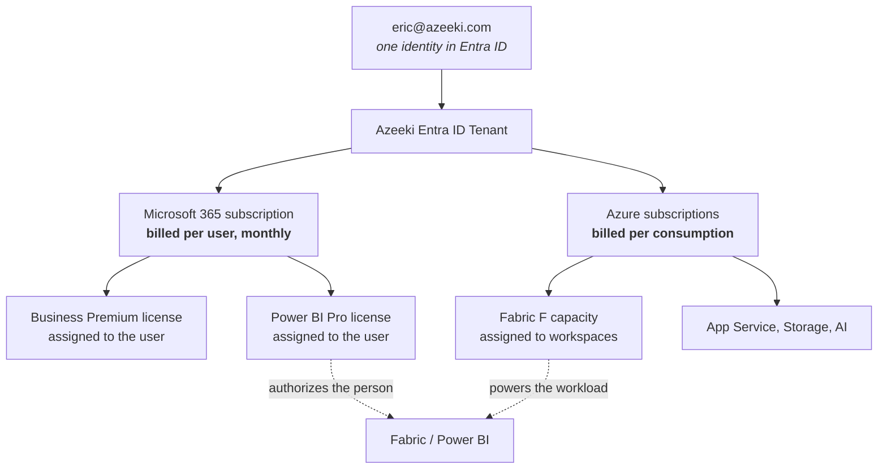

# Azeeki — Licensing Action Plan & Reading Guide

**Created:** September 2, 2026
**Goal:** One Entra ID tenant. One identity — `eric@azeeki.com`. One login that reaches
Microsoft 365, Azure, Fabric, and Power BI.
**Companion:** `Initial-Plan.md` is the build sequence. This document is the licensing
decisions and the reading behind them.

> All links are Microsoft Learn first-party documentation. Pricing pages are marked
> separately because prices change and Learn does not publish them.

---

## Part 1 — The Mental Model

### 1.1 How "one login" actually works

The single identity is not a feature you turn on. It is a consequence of putting
everything in one tenant.

The distinction that trips people up:

| Question | Answer |
|---|---|
| What lets **the person** use Power BI? | A per-user license (Free, Pro, or PPU) — bought on the Microsoft 365 side |
| What **runs the workload**? | A capacity (Fabric F SKU) — bought on the Azure side |
| Do you need both? | For anything beyond a personal workspace, yes |

**Start here — 15 minutes:**
- [What is Microsoft 365 for business](https://learn.microsoft.com/microsoft-365/admin/admin-overview/what-is-microsoft-365-for-business)
- [Add your custom domain name to your tenant](https://learn.microsoft.com/entra/fundamentals/add-custom-domain)

### 1.2 Why the tenant must be created before anything else

Every license and every Azure subscription attaches to a tenant. Tenants cannot be
merged. If you activate Azure credits with a personal Microsoft account first, those
resources land in a different directory and you will rebuild.

**Read — 10 minutes:**
- [Add a custom domain to Microsoft 365](https://learn.microsoft.com/microsoft-365/admin/setup/add-domain)

---

## Part 2 — The Four Licensing Decisions

Four decisions. Each has a reading list, what you are actually choosing, and a
recommendation.

---

### Decision 1 — Microsoft 365 plan

**Choosing between:** Business Basic, Business Standard, Business Premium.

**Reading — 30 minutes:**

| Priority | Document | Why |
|---|---|---|
| **Must** | [Microsoft 365 Business Premium FAQ](https://learn.microsoft.com/microsoft-365/business-premium/microsoft-365-business-faqs) | Directly answers Standard vs. Premium vs. Enterprise |
| **Must** | [Microsoft 365 Business Premium overview](https://learn.microsoft.com/microsoft-365/business-premium/m365bp-overview) | What the security stack actually does |
| Should | [Microsoft 365 and Office 365 plan options](https://learn.microsoft.com/office365/servicedescriptions/office-365-platform-service-description/office-365-plan-options) | Full plan taxonomy including Enterprise |
| Should | [What is Microsoft Defender for Business](https://learn.microsoft.com/defender-business/mdb-overview) | The single biggest Premium delta |
| Reference | [Microsoft 365 service descriptions library](https://learn.microsoft.com/office365/servicedescriptions/office-365-service-descriptions-technet-library) | Feature-by-feature, by plan |
| Pricing | [Compare Microsoft 365 Business plans](https://aka.ms/M365BusinessPlans) | Current prices |

**What you are really deciding:** whether you get **Entra ID P1** and **Intune**.

| Capability | Basic | Standard | Premium |
|---|:--:|:--:|:--:|
| Email, Teams, SharePoint, OneDrive | Yes | Yes | Yes |
| Desktop Office apps | No | Yes | Yes |
| **Entra ID P1 — Conditional Access** | No | No | **Yes** |
| **Intune — device management** | No | No | **Yes** |
| **Defender for Business** | No | No | **Yes** |
| Defender for Office 365 P1 | No | No | Yes |
| Sensitivity labels, DLP | No | No | Yes |

**Recommendation: Business Premium.**

Without P1 you are limited to Security Defaults, which is all-or-nothing. You cannot
build a Conditional Access policy that excludes break-glass accounts, and you cannot
require a compliant device for administrative access. Without Intune you cannot manage
the new laptop, enforce BitLocker, or wipe it if it is lost.

Business Premium is capped at 300 seats — irrelevant now, and you would move to
Enterprise long before that.

---

### Decision 2 — Power BI per-user license

**Choosing between:** Fabric Free, Power BI Pro, Premium Per User.

**Reading — 45 minutes. This is the section most worth your time.**

| Priority | Document | Why |
|---|---|---|
| **Must** | [Understand Microsoft Fabric licenses and capacity](https://learn.microsoft.com/fabric/enterprise/licenses) | The single most important page. Per-user vs. capacity, workspace types, SKU table. |
| **Must** | [Power BI service features by license type](https://learn.microsoft.com/power-bi/fundamentals/service-features-license-type) | Exactly what Free vs. Pro vs. PPU can do |
| **Must** | [Power BI licensing guide for organizations](https://learn.microsoft.com/fabric/enterprise/powerbi/service-admin-power-bi-licensing) | How licenses and capacity combine |
| Should | [Power BI implementation planning: subscriptions, licenses, and trials](https://learn.microsoft.com/power-bi/guidance/powerbi-implementation-planning-subscriptions-licenses-trials) | Planning-grade guidance you will reuse with clients |
| Should | [Purchasing Power BI Pro](https://learn.microsoft.com/power-bi/enterprise/service-admin-purchasing-power-bi-pro) | How to actually buy it |
| Reference | [Buy or manage add-ons](https://learn.microsoft.com/microsoft-365/commerce/buy-or-edit-an-add-on) | Mechanics of adding Pro to Business Premium |

**Key facts, confirmed:**

- A **Free** license is granted automatically on first Fabric sign-in, if Fabric is
  enabled in the tenant
- To create Power BI content outside *My workspace* **and share it**, you need **Pro** or
  **PPU**
- **PPU does not provision Fabric capacity.** Lakehouses, warehouses, and notebooks still
  require an F capacity or trial capacity
- Power BI Premium **P SKUs are retiring**; F SKUs are the replacement

**Recommendation: Power BI Pro, one seat.**

PPU is only worth it if you need Premium features without capacity — but you will have
an F capacity for Fabric work anyway, which makes PPU redundant at your scale.

---

### Decision 3 — Fabric capacity

**Choosing between:** trial, F2, F4, or larger — and when to buy.

**Reading — 30 minutes:**

| Priority | Document | Why |
|---|---|---|
| **Must** | [Fabric licenses — core building blocks](https://learn.microsoft.com/fabric/enterprise/licenses#core-building-blocks) | The full F SKU / CU / v-core table |
| **Must** | [Start a Fabric capacity trial](https://learn.microsoft.com/fabric/get-started/fabric-trial) | 60 days, F64-equivalent, free |
| **Must** | [Pause and resume your Fabric capacity](https://learn.microsoft.com/fabric/enterprise/pause-resume) | The single biggest cost lever you have |
| Should | [Buy Fabric capacity in Azure](https://learn.microsoft.com/fabric/enterprise/buy-capacity) | Purchase mechanics and reservations |
| Should | [Cost considerations for Fabric workloads](https://learn.microsoft.com/azure/well-architected/microsoft-fabric/cost-optimization) | WAF guidance, including automation |
| Should | [Power BI Premium to Fabric migration FAQ](https://learn.microsoft.com/power-bi/support/premium-migration-faq) | P SKU retirement — you will be asked about this by clients |
| Reference | [Pause and resume in Fabric Data Warehouse](https://learn.microsoft.com/fabric/data-warehouse/pause-resume) | Behavior when a warehouse is on a paused capacity |

**SKU reference:**

| SKU | CUs | Power BI equivalent |
|---|---|---|
| F2 | 2 | — |
| F4 | 4 | — |
| F8 | 8 | EM/A1 |
| F16 | 16 | EM2/A2 |
| F32 | 32 | EM3/A3 |
| **F64** | 64 | **P1/A4** |
| **Trial** | **64** | — |

**Recommendation:** start the **60-day trial today**. It is F64-equivalent at no cost.
Provision an **F2** near the end of the trial, and **pause it whenever you are not
actively working**. An F2 left running costs roughly $260/month for something you will
use a few hours a week; paused, compute drops to zero and only OneLake storage bills.

---

### Decision 4 — Azure subscriptions

**Choosing between:** Visual Studio credit only, or credit plus Pay-As-You-Go.

**Reading — 25 minutes:**

| Priority | Document | Why |
|---|---|---|
| **Must** | [Azure for Visual Studio subscribers FAQ](https://learn.microsoft.com/visualstudio/subscriptions/faq/subscriber/azure/) | The restrictions. Read the whole page. |
| **Must** | [What is the Azure Dev/Test offer](https://learn.microsoft.com/azure/devtest/offer/overview-what-is-devtest-offer-visual-studio) | Individual credit vs. Dev/Test PAYG |
| **Must** | [Get started with your individual Azure credit subscription](https://learn.microsoft.com/azure/devtest/offer/quickstart-individual-credit) | How to activate — do this signed in as `eric@azeeki.com` |
| Should | [Azure Dev/Test credits by subscription level](https://learn.microsoft.com/visualstudio/subscriptions/vs-azure-eligibility) | How much credit you actually get |
| Should | [What are Visual Studio Subscriptions](https://learn.microsoft.com/visualstudio/subscriptions/what-are-subscriptions) | Confirms whether you have the M365 E5 dev benefit |
| Should | [Maintain a VS subscription for Azure credit access](https://learn.microsoft.com/visualstudio/subscriptions/azure-access) | What happens if the subscription lapses |
| Reference | [Switch your Azure offer](https://learn.microsoft.com/azure/cost-management-billing/manage/switch-azure-offer) | Converting credit to PAYG later |
| Reference | [Protect your resource hierarchy](https://learn.microsoft.com/azure/governance/management-groups/how-to/protect-resource-hierarchy) | Management group setup |

**The constraints that decide this:**

| Constraint | Effect |
|---|---|
| Dev/test use only, explicitly not production | Client-facing work disqualified |
| No financially backed SLA | Never point a client at it |
| Instances running continuously **> 120 hours** may be suspended | Kills always-on demos and always-on capacity |
| Credit excludes Application Insights, Azure DevOps, support plans, Entra ID P2 | Budget separately |
| Credits cannot be pooled between people | Does not scale |
| Azure subscription is disabled if the VS subscription lapses | Continuity risk |

**Recommendation: both.** `Azeeki-Sandbox` on the VS credit for learning and throwaway
work. `Azeeki-Prod` on Pay-As-You-Go for Fabric capacity, client demos, and anything that
must still exist next quarter.

---

## Part 3 — The Trap You Need to Know About Before You Demo

**On Fabric F SKUs smaller than F64, every user who views Power BI content needs their
own Pro, PPU, or trial license.** Free-license viewing only works on **F64 or larger**.

For a Power BI consultancy running an F2, this directly affects client demos.

| Approach | Client needs a license? | Notes |
|---|:--:|---|
| **Screen share the demo** | No | Simplest. Covers most sales conversations. |
| **App owns data embedding** | No | Service principal authenticates; end users unlicensed. Works on any F SKU. |
| Guest account in your tenant + Pro | **Yes** | You would be buying licenses for prospects |
| Scale to F64 for the demo window | No | Expensive, but viable for a short scheduled session |

**Read before your first client demo — 20 minutes:**
- [Capacity and SKUs in Power BI embedded analytics](https://learn.microsoft.com/power-bi/developer/embedded/embedded-capacity)
- [Fabric licenses — workspace types](https://learn.microsoft.com/fabric/enterprise/licenses#workspace-types)

Default to screen sharing. Build the embedded path only when a client asks for
self-service access.

---

## Part 4 — Identity and Security Reading

Not licensing, but it determines whether Decision 1 was correct.

| Priority | Document | Why |
|---|---|---|
| **Must** | [Manage emergency access accounts in Entra ID](https://learn.microsoft.com/entra/identity/role-based-access-control/security-emergency-access) | Break-glass. Read before creating any policy. |
| **Must** | [Plan a Conditional Access deployment](https://learn.microsoft.com/entra/identity/conditional-access/plan-conditional-access) | Requires P1, i.e. Business Premium |
| **Must** | [Mandatory MFA for Azure and admin portals](https://learn.microsoft.com/entra/identity/authentication/concept-mandatory-multifactor-authentication) | Applies to break-glass accounts too |
| Should | [Passkeys and FIDO2 in Entra ID](https://learn.microsoft.com/entra/identity/authentication/how-to-authentication-passkeys-fido2) | The right credential for break-glass |
| Should | [Common Conditional Access policies](https://learn.microsoft.com/entra/identity/conditional-access/concept-conditional-access-policy-common) | Templates to start from |
| Should | [Resilient access control strategy](https://learn.microsoft.com/entra/identity/authentication/concept-resilient-controls) | Contingency policies |
| Reference | [Managed identities overview](https://learn.microsoft.com/entra/identity/managed-identities-azure-resources/overview) | For App Service demos — no connection strings |

---

## Part 5 — Purchase Sequence

Order matters. Do not skip ahead.

| # | Action | Depends on | Notes |
|---|---|---|---|
| 1 | Buy **M365 Business Premium**, 1 seat, **direct from Microsoft** | — | Creates the tenant. Not through GoDaddy. |
| 2 | Set tenant country to **United States** | 1 | Permanent |
| 3 | Choose `azeeki.onmicrosoft.com` | 1 | Permanent |
| 4 | Create break-glass accounts | 1 | **Before any Conditional Access policy** |
| 5 | Add and verify `azeeki.com` | 1 | Website DNS untouched |
| 6 | Create `eric@azeeki.com`, assign Business Premium | 5 | — |
| 7 | Add **Power BI Pro** to that user | 6 | Add-on purchase |
| 8 | Turn off Security Defaults, build CA policies | 4, 6 | Report-only first |
| 9 | Activate VS Azure credit **as `eric@azeeki.com`** | 6 | Lands in the right tenant |
| 10 | Create the **Pay-As-You-Go** subscription | 6 | Business card |
| 11 | Start the **Fabric trial** | 7 | Free for 60 days |
| 12 | Confirm the Fabric home region | 11 | Capacity must match later |
| 13 | Set Azure budgets and alerts | 10 | Before any spend |
| 14 | Provision **F2** and establish the pause habit | 12 | Near trial expiry |

---

## Part 6 — Expected Monthly Cost

| Item | Where billed | Approximate | Notes |
|---|---|---|---|
| M365 Business Premium × 1 | Microsoft 365 | ~$22 | Annual commitment is cheaper |
| Power BI Pro × 1 | Microsoft 365 | ~$14 | Add-on |
| Fabric F2 | Azure | ~$0.36/hr | **~$260 if left running. Pause it.** |
| App Service B1 (demos) | Azure | ~$13 | Only while a demo exists |
| Storage, misc. | Azure | ~$5-20 | Varies |
| VS credit subscription | — | $0 | Benefit |

**Steady state with disciplined pausing: roughly $60-90/month.**
**Steady state with the capacity left running: roughly $300+/month.**

The difference is one habit. Verify all pricing at purchase.

---

## Part 7 — Decision Record

Fill this in as you decide. Copy into the rebrand tracker if useful.

| ID | Decision | Options | Chosen | Date | Rationale |
|---|---|---|---|---|---|
| LIC-01 | Microsoft 365 plan | Basic / Standard / **Premium** | | | |
| LIC-02 | Power BI per-user | Free / **Pro** / PPU | | | |
| LIC-03 | Fabric capacity | **Trial → F2** / F4 / F64 | | | |
| LIC-04 | Azure subscriptions | Credit only / **Credit + PAYG** | | | |
| LIC-05 | Client demo delivery | **Screen share** / embedded / F64 | | | |
| LIC-06 | Admin account model | Separate `adm.` account / GA on daily driver | | | |
| LIC-07 | Primary Azure region | East US 2 / other | | | Must match Fabric home region |
| LIC-08 | Annual vs. monthly M365 commitment | | | | Annual is cheaper, less flexible |

Bolded options are the recommendations in this document.

---

## Part 8 — Reading Order If You Only Have an Hour

1. [Understand Microsoft Fabric licenses and capacity](https://learn.microsoft.com/fabric/enterprise/licenses) — 20 min. The highest-value page here.
2. [Azure for Visual Studio subscribers FAQ](https://learn.microsoft.com/visualstudio/subscriptions/faq/subscriber/azure/) — 10 min. Prevents the most expensive mistake.
3. [Microsoft 365 Business Premium FAQ](https://learn.microsoft.com/microsoft-365/business-premium/microsoft-365-business-faqs) — 10 min. Settles Decision 1.
4. [Manage emergency access accounts](https://learn.microsoft.com/entra/identity/role-based-access-control/security-emergency-access) — 10 min. Prevents tenant lockout.
5. [Pause and resume your Fabric capacity](https://learn.microsoft.com/fabric/enterprise/pause-resume) — 5 min. Saves ~$200/month.

Everything else can wait until the decision in front of you needs it.
